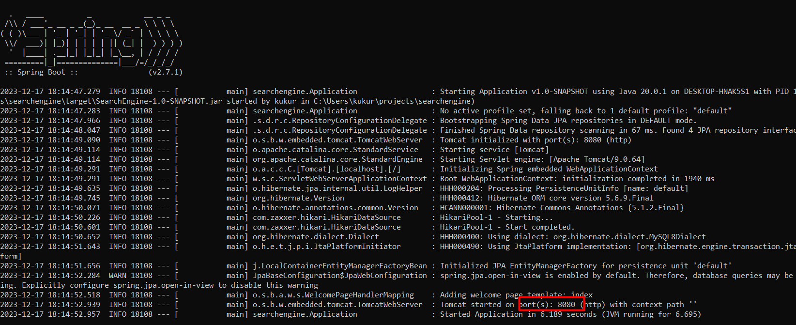
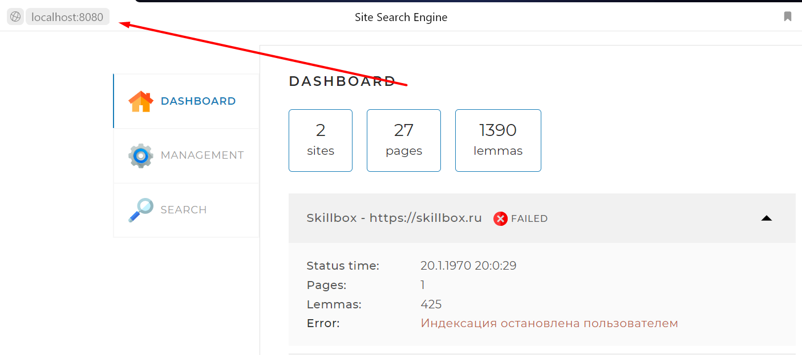

# Поисковый движок

## Описание проекта
Проект служит для поиска информации на сайтах. 
Перед началом поиска нужно предварительно проиндексировать сайт.
Для удобства можно использовать веб-интерфейс

## Стэк используемых технологий
* Java
* Maven
* MySQL
* JavaScript

## Инструкция
### Конфигурация проекта
Для корректной работы проекта, после установки необходимого по,
нужно сконфигурировать проект. [Пример файла](src/main/resources/application.yaml)
* server.port - Порт бд
* spring.datasource.username - Пользователь бд
* spring.datasource.password - Пароль бд
* spring.datasource.url - Адрес бд
* indexing-settings.sites - Список индексируемых сайтов

Остальные параметры можно оставить без изменений

### Сборка и запуск приложения
После того как приложение было сконфигурировано, его нужно собрать.
Для этого введите в терминале команду ниже:
```shell
mvn package
```
После завершение сборки можно запустить проект.
Для этого введите следующую команду:
```shell
java -jar target\SearchEngine-1.0-SNAPSHOT.jar
```

После запуска приложения оно будет доступно на порту
который указан в логах запуска приложения


